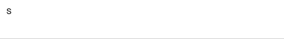

# dom-typer.js

## what is dom-typer.js?

**dom-typer** is a plugin witten in JavaScript, which can be used to output a string in typer style.


## usage

### Installation

```

npm install dom-js --save

```

### Import

```javascript
import Typer from "dom-typer";
```

### Basic Use

```javascript
let output = "";
const typer = new Typer("I will be output letter by letter.");
typer.type((o) => {
  output = o;
});

// you can reuse later by doing this
typer.reset("Other string that you want to output.").type((o) => {
    console.log(o)
});

// alternatively, you can use callback to do something when entire process finished
typer.type(
  (currentOutput) => {
    // will be called every time when one letter finished typing
  },

  (entireOutput) => {
    // will be called when the whole string finished typing
    console.log('Typing work finished! ')
  }
);
```

### Render DOM

I created this plugin to better show typer style in web-app, so you can also do this to render your styled text. Here is the way to use it in a Vue project:

```html
<template>
  <div>{{ msg }}</div>
</template>
```

```javascript
export default {
  data() {
    return {
      typer: new Typer("String that you want to render letter by letter."),
      msg: "",
    };
  },

  mounted() {
    this.typer.type((output) => {
      this.msg = output;
    });
  },
};
```

### Bold Style

Bold text is also supported. What you need is to wrap the specific text part with `**`, just like Markdown syntax, and then the text rendered in your web-app will easily become bold style.

```javascript
const typer = new Typer("String that you want to **accent**. ");
```



